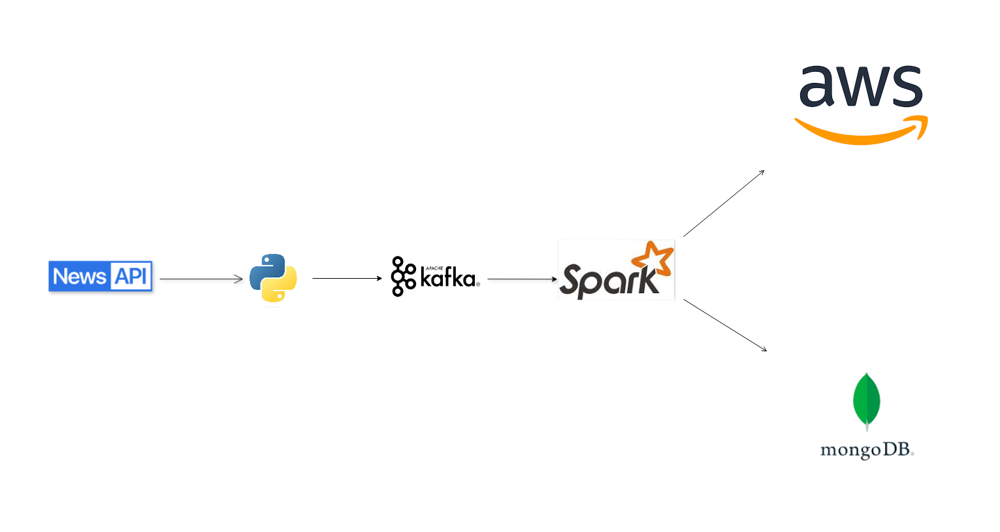

# 📰 Real-Time News ETL Pipeline with Kafka, Spark, MongoDB, and AWS S3

This project demonstrates a real-time data processing pipeline that extracts news articles using the NewsAPI, streams them through Apache Kafka, processes them using Apache Spark Structured Streaming, and stores the transformed data into MongoDB and Amazon S3.

---

## 🔄 Workflow Diagram



----

## 📌 Components

### 1. **Kafka Producer (`kafka_producer.py`)**
- Fetches news articles from [NewsAPI](https://newsapi.org/) based on a set of keywords.
- Sends the articles as JSON messages to the Kafka topic `newstopic` every 10 seconds.
- Includes a timestamp field for each message.

### 2. **Spark Structured Streaming (`spark_mongodb_awsS3.py`)**
- Reads the streaming data from the Kafka topic `newstopic`.
- Parses the incoming JSON data (title, author, description, timestamp).
- Writes the structured output to:
  - **MongoDB** (local instance)
  - **Amazon S3** in CSV format

---

## 🛠️ Technologies Used

- **Apache Kafka** – Real-time data streaming
- **Apache Spark** – Real-time stream processing
- **MongoDB** – NoSQL document database
- **AWS S3** – Cloud storage for data lake
- **Python** – Scripting language
- **NewsAPI** – External data source

---

## 🔧 Setup Instructions

### Prerequisites

- Kafka and Zookeeper running locally
- Spark 3.x with required packages
- MongoDB running locally
- AWS S3 bucket created
- Python 3.x with `requests`, `kafka-python`, and `pyspark` libraries

### Spark Dependencies

Ensure the following packages are included:
```bash
org.apache.spark:spark-sql-kafka-0-10_2.13:3.5.0  
org.mongodb.spark:mongo-spark-connector_2.13:10.3.0  
org.apache.hadoop:hadoop-aws:3.3.4  
com.amazonaws:aws-java-sdk-bundle:1.12.262
```

### Configurations to Update

- **Kafka Bootstrap Servers:** `localhost:9092`
- **MongoDB URI:** Update Mongo URI if not using default `localhost:27017`
- **AWS Credentials:** Replace with your actual access key and secret key in `spark.hadoop.fs.s3a.access.key` and `secret.key`
- **S3 Bucket Path:** Update in the `.save()` method to match your S3 path

---

## 🚀 How to Run

### 1. Start Kafka and Zookeeper
```bash
bin/zookeeper-server-start.sh config/zookeeper.properties
bin/kafka-server-start.sh config/server.properties
```

### 2. Run Kafka Producer
```bash
python kafka_producer.py
```

### 3. Run Spark Streaming Job
```bash
spark-submit spark_mongodb_awsS3.py
```

---

## 📂 Output

- **MongoDB:** News data stored in `mydatabase.mycollection`
- **AWS S3:** CSV files saved to `s3a://newsapi-etl-nivedya/news_streamed_output/`

---

## 📈 Sample Schema

```json
{
  "title": "News headline",
  "author": "Reporter name",
  "description": "News summary",
  "timestamp": "2025-08-05T10:00:00"
}
```
